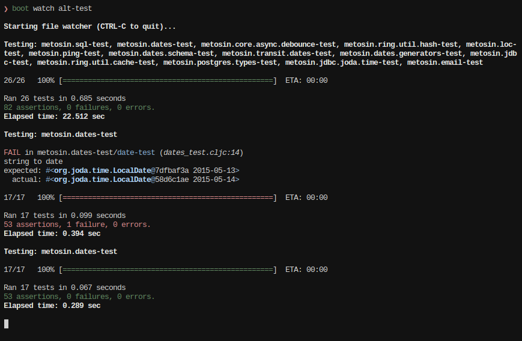

# Bat-test [](https://clojars.org/metosin/bat-test)

> Formerly known as Boot-alt-test

Fast Clojure.test runner for [Boot](http://boot-clj.com/) and [Leiningen](https://leiningen.org/).

## Features

- **Requires tools.namespace 0.3.0-alpha3**
- Uses [eftest](https://github.com/weavejester/eftest) to display pretty reports
    - Can optionally run tests parallel
    - Can capture output and display the output just for the failing tests (`:capture-output?`, enabled by default)
    - Can be configured to stop running tests after the first failure (`:fail-fast?`)
    - Can run tests in deterministically random order (`:randomize-seed`, defaults to 0)
- Easy way to setup and combine eftest reporters:
    - Built-in reporters can be referred by keywords `:pretty`, `:progress` and `:junit`
    - Reporter can be map with `:type` (referring to reporter fn) and option `:output-to`
    which will redirect the output to a file.
    - Multiple reporters can be combined when defining them as vector:
    `(bat-test :report [:pretty {:type :junit :output-to "target/junit.xml"}])`
- Uses [clojure.tools.namespace](https://github.com/clojure/tools.namespace) to reload
changed namespaces and to run only the tests in changed or affected namespaces
- Tries to recover from namespace reload errors so that no process restart is needed
    - This means that after some exceptions all the namespaces have to reloaded
    - Related: ([CTN-6](http://dev.clojure.org/jira/browse/TNS-6), [CTN-24](http://dev.clojure.org/jira/browse/TNS-24))
- Run all tests by hitting `enter`
- Two hooks to manage the test environment
    - `on-start` hook: run a function before any tests are run
    - `on-end` hook: run a function after all tests are run
- [Cloverage](https://github.com/cloverage/cloverage) integration
    - `cloverage-opts` option to set (subset) of Cloverage options
    - `boot bat-test -c` or `lein bat-test cloverage`
    - Probably doesn't work well together with `watch` task



### Leiningen features

- Built-in file change watcher
- Copies lein-test API, e.g. test-selectors:
    - `lein bat-test :only namespace/test-var`
    - `lein bat-test only-this-namespace`
    - `lein bat-test :integration`
- `:notify-command` for calling `notify-send` or Growl or such

## Boot Usage

1. Add `[metosin/bat-test "X.X.X" :scope "test"]` as a dependency in your
  `build.boot`

1. Add `(require '[metosin.bat-test :refer (bat-test)])` somewhere in your
   build.boot to make the task available to your Boot workflow.

1. Run `boot bat-test` at the command-line or `(boot (bat-test))` in the REPL, or add `bat-test` task as part of your Boot pipeline.

See `boot bat-test -h` for a list of available task options.

## Lein Usage

1. Add `[metosin/bat-test "X.X.X"]` as a plugin in your `project.clj`

1. Add options under `:bat-test` key in project map and run `lein bat-test` at the command-line

See `lein bat-test help` for a list of available task options.

## Clojure CLI Usage

### Main style

### Exec style

Add the following alias to your deps.edn:

```clojure
{:aliases {:test {:extra-deps {metosin/bat-test {...}}
                  :extra-paths ["test"]
                  :exec-fn metosin.bat-test.cli/exec
                  :exec-args {:test-dirs ["test"]}}}}
```

Invoke with exec (`-X`), and see `metosin.bat-test.cli/{test,exec,run-tests}` for options. Here are some examples:

```sh
# run all tests once
clojure -X:test

# continuously run tests
clojure -X:test :watch true

# run tests in parallel
clojure -X:test :parallel true

# just test files under particular directories (handy for monorepos)
clojure -X:test :test-dirs '["module1" "module3"]'

# use Leiningen-style test selectors (see next section for custom selectors)
clojure -X:test :selectors '[:all]' # <- lein test :all
clojure -X:test :selectors '[my-ns :only other-ns/foo]' # <- lein test my-ns :only other-ns/foo
```

### Handy default arguments

Use `:exec-args` for default values. Especially useful for Leiningen-style test selectors:

eg.,

```clojure
; selectors.clj
{:default (clojure.core/complement (clojure.core/some-fn :integration :disabled))
 :integration :integration
 :all (clojure.core/complement :disabled)}
```

```clojure
; deps.edn
{:aliases {:test {:extra-deps {metosin/bat-test {...}}
                  :extra-paths ["test"]
                  :exec-fn metosin.bat-test.cli/exec
                  :exec-args {:test-dirs ["test"]
                              ;; add this line
                              :test-selectors-form-file "selectors.clj"}}}}
```

You can share this file with Leiningen like so:

```clojure
; project.clj
(defproject ...
  :test-selectors ~(-> "selectors.clj" slurp read-string))
```

## REPL Usage

Almost identical to Clojure CLI usage (above), except use `metosin.bat-test.cli/test`.

The major difference is that `test` throws exceptions, whereas `metosin.bat-test.cli/exec` uses `System/exit` (you don't
want this at the REPL).

You may want to create your own wrapper to provide some default arguments:

```clojure
(ns my-repl-ns
  (:refer-clojure :exclude [test])
  (:require [metosin.bat-test.cli :as bat-test]))

(defn test [args]
  (bat-test/test (into {:test-selectors-form-file "selectors.clj"} args)))
```

## License

Copyright © 2016-2019 [Metosin Oy](http://www.metosin.fi)

Distributed under the Eclipse Public License either version 1.0 or (at your option) any later version.
